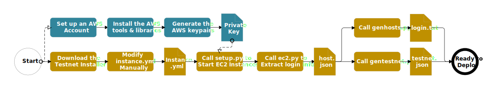

# aws-ansible

The tools and libraries to set up hosting instances on aws cloud.

## 1. Preparation

### 1.1. AWS Preperation

* Create an AWS account;
* Create new user with permission policy **AmazonEC2FullAccess**；
* Create access key；
* Save access key in secret.yml in the same directory as the other scripts like this：

```yaml
ec2_access_key: THISISYOURACCESSKEY
ec2_secret_key: ThisIsYourSecretKey
```

### 1.2. Setup Client Environment

* Install python3 and pip;
* Install ansible;
* Use pip to install ansible, boto and boto3 python libraries;
* Install awscli and login with your AWS account;
* Use ansible-vault to encrypt your secret.yml, save your vault's password in a file named **vault** in the same directory as the other scripts.

### 1.3. Installation Process



## 2. Create EC2 Instances

Currently AWS imposes a limit on number of vCPU for On-Demand instances, so you may need to request limit increase.  

### 2.1. Edit instances.yml

The instances.yml contains region and type information regrading hosting instances on AWS.

### 2.2. Create EC2 Instances with setup.py

Run setup.py to create EC2 instances according to the configuration info in instances.yml.

```shell
$ setup.py
```

### 2.3. Get List of EC2 Instance

After running setup.py successfully, use ec2.py to get the information of all the EC2 instances. Output the information to host.json, this file will be used in the following installation scripts.

```shell
$ ec2.py > host.json
```

## 3. **Setup Basic Runtime Environment**

use genhosts.py create configuration file for setup basic runtime environment.

```shell
$ python3 genhosts.py host.json ubuntu ../env/envs
```
- ubuntu        ---  login account name
- ../env/envs  --- configuration file


run script to setup basic runtime environment

```shell
$ cd ../env
$ ansible-playbook -i envs install.yml
```

## 4. **Install and Start the Testnet**

use genhosts.py create configuration file for setup testnet.

```shell
$ python3 gentestnet.py host.json ubuntu ../cluster/testnet.json 50000 testnet 2 4 /data
```

- ubuntu                                ---  login account name
- ../cluster/testnet.json       --- configuration file
- 50000                                  --- max txs of per block
- 2                                           --- node nums of cluster
- 4                                           --- concurrency
- /data                                    --- remote path

```shell
$ cd ../cluster
$ python3 svcsInstaller.py restart testnet.json 4 5000000 -sshkey 
```

