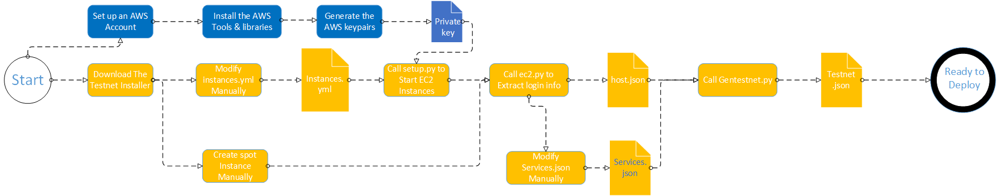

# aws-ansible

The tools and libraries to set up hosting instances on aws cloud.

## 1. Preparation

### 1.1. AWS Preperation

* Create an AWS account;
* Create new user with permission policy **AmazonEC2FullAccess**；
* Create access key；
* Save access key in secret.yml in the same directory as the other scripts like this：

```yaml
ec2_access_key: THISISYOURACCESSKEY
ec2_secret_key: ThisIsYourSecretKey
```

### 1.2. Setup Client Environment

* Install python3 and pip;
* Install ansible;
* Use pip to install ansible, boto and boto3 python libraries;
* Install awscli and login with your AWS account;
* Use ansible-vault to encrypt your secret.yml, save your vault's password in a file named **vault** in the same directory as the other scripts.

### 1.3. Installation Workflow



## 2.Create Image

### 2.1.Edit instances.yml

The instances.yml contains region and type information regrading hosting instances on AWS.

If EC2 Instances have created by spot,we could skip this step. 

### 2.2.Edit services.json 

The services.json contains services and logic module information per host.

### 2.3.Create EC2 Instances and testnet  Configuration

Create EC2 instances according to the configuration info in instances.yml,or use spot instances by manually created to create testnet.json according to the configuration info in service.json.

```shell
aws> ./setup-aws.sh -i instances-image-1.7.yml -t ../cluster/testnet.json -r region.json  -s service.json -b ../bak -q true
```

| Field | Description                |
| ----- | -------------------------- |
| i     | instances configure file   |
| t     | testnet configuration file |
| r     | regions configuration file |
| s     | service configuration file |
| b     | tmp path  for bak          |
| q     | spot mode                  |

### 2.4.Create configuration file

```shell
cluster> python splitconf.py testnet.json ../env/host ../env/login.txt all
```

| Field            | Description                    |
| ---------------- | ------------------------------ |
| testnet.json     | cluster configuration file     |
| ../env/host      | statistics configuration files |
| ../env/login.txt | new lgoin.txt                  |
| all              | node tag                       |

### 2.5.Install Dependencies

```shell
env> ./setup-env.sh login.txt 
```

| Field           | Description                        |
| --------------- | ---------------------------------- |
| login.txt       | login configuration file           |
| cluster,aws,nil | No this parameter when make docker |

### 2.6.Setup image

```shell
cluster> ./createimage.sh -l ../env/login.txt
```

| Field | Description              |
| ----- | ------------------------ |
| -l    | login configuration file |

### 2.7.Create image on aws 

In the aws console, right-click on the selected ec2 instance, save it as image, copy the image id, and to update instances.yml.

## 3. Create EC2 Instances

>Currently AWS imposes a limit on maximum number of vCPU for On-Demand instances, so you may need to request limit increase.  

### 3.1.Edit instances.yml

The instances.yml contains region and type information regrading hosting instances on AWS.

If EC2 Instances have created by spot,we could skip this step. 

### 3.2.Edit services.json 

The services.json contains services and logic module information per host.

### 3.3.Create EC2 Instances and testnet  Configuration

Create EC2 instances according to the configuration info in instances.yml,or use spot instances by manually created to create testnet.json according to the configuration info in service.json.

```shell
aws> ./setup-aws.sh -i instances-1.7.yml -t ../cluster/testnet.json -r region.json  -s service.json -b ../bak -q true
```

| Field | Description                |
| ----- | -------------------------- |
| i     | instances configure file   |
| t     | testnet configuration file |
| r     | regions configuration file |
| s     | service configuration file |
| b     | tmp path  for bak          |
| q     | spot mode                  |

